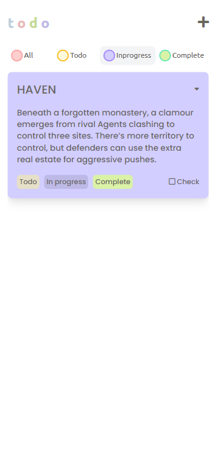

<h1 align="center">Todo List</h1>

    

## About

---

### A very basic todo list with create, edit and delete functionalities. It is a great project to test you skills of DOM manipulation. It is fully responsive.

 

## Live Demo

---

[Todo List]('https://elegant-kilby-7b1e4e.netlify.app/')

 

## Functionalities

-   Create
-   Edit
-   Update
-   Delete

## Screenshots

---

### Web

---

    
    
    
    
    

---

### Mobile

---

    
    
    
    

 
 

## Prototype

---

### In case you want to know how I got the design, it's for you. It's not mine. I got it from [behance](https://www.behance.net/gallery/107935847/Todo-List-Desktop-Mobile-app-UI-Design), thanks to her for the beautiful design concept.

 
 

## Installation

---

-   Run `git clone https://github.com/b-l-i-n-d/Todo-list.git`
-   Run `cd Todo-list`
-   Run `npm install`
-   Start `live server`
